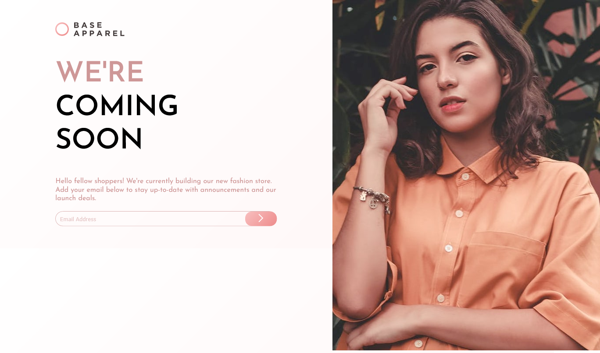

# Frontend Mentor - Base Apparel coming soon page solution

This is a solution to the [Base Apparel coming soon page challenge on Frontend Mentor](https://www.frontendmentor.io/challenges/base-apparel-coming-soon-page-5d46b47f8db8a7063f9331a0). Frontend Mentor challenges help you improve your coding skills by building realistic projects. 

## Table of contents

- [Overview](#overview)
  - [The challenge](#the-challenge)
  - [Screenshot](#screenshot)
  - [Links](#links)
- [My process](#my-process)
  - [Built with](#built-with)
  - [What I learned](#what-i-learned)
  - [Continued development](#continued-development)
  <!-- - [Useful resources](#useful-resources) -->
- [Author](#author)
<!-- - [Acknowledgments](#acknowledgments) -->

**Note: Delete this note and update the table of contents based on what sections you keep.**

## Overview

### The challenge

Users should be able to:

- View the optimal layout for the site depending on their device's screen size
- See hover states for all interactive elements on the page
- Receive an error message when the `form` is submitted if:
  - The `input` field is empty
  - The email address is not formatted correctly

### Screenshot




### Links

- Solution URL: [Add solution URL here](https://your-solution-url.com)
- Live Site URL: [Add live site URL here](https://your-live-site-url.com)

## My process

### Built with

- Semantic HTML5 markup
- CSS custom properties
- Flexbox
- Mobile-first workflow


### What I learned

In this challenge I learned 
- How to do client side form validation using javascript
- Using box-shadow
- How to use linear gradient

```js
function ValidateEmail(inputText)
{
let none = document.getElementById('none');
let nonetext = document.getElementById('nonetext');
var mailformat = /^\w+([\.-]?\w+)*@\w+([\.-]?\w+)*(\.\w{2,3})+$/;
if(inputText.value.match(mailformat))
{
document.form1.text1.focus();
none.style.display = 'none';
nonetext.style.display = 'none';

return true;
}
else
{
document.form1.text1.focus();
none.style.display= 'inherit';
nonetext.style.display= 'inherit';
return false;
}

}
}
```


### Continued development

I don't think the image scales as I want it to be. I would really like to work on image scaling again using css.


## Author

- Website - [Add your name here](https://www.jitesh117.me)
- Frontend Mentor - [@jitesh117](https://www.frontendmentor.io/profile/jitesh117)
- Twitter - [@yourusername](https://www.twitter.com/Jitesh_117)

<!-- **Note: Delete this note and add/remove/edit lines above based on what links you'd like to share.** -->


